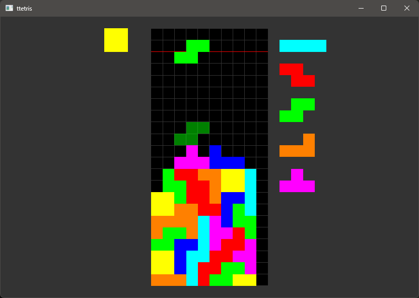

# ttetris



Stacking game/tool written in Rust + Windows API + OpenGL.

## Features

- [ ] Top out detection
- [x] Restart functionality
- [x] Queue preview
- [x] Hold
- [x] SRS (Super Rotation System)
- [x] 7 piece bad randomizer
- [x] Undo/([] Redo)
- [x] Settings file
- [ ] In game settings
- [ ] Practice mode/backfire/cheese
- [ ] Scoring/garbage counting
- [ ] Statistics (like finess/pps/app etc)
- [ ] Integration as a client for other muliplayer platforms
- [ ] Sounds
- [ ] Skins/appearance improvements

## Get started

Clone the repo and run

```bash
cargo run -r
```

Default controls:

| Action | Assignment |
| - | - |
| Shift left | Arrow left |
| Shift right | Arrow right |
| Hard drop | Arrow up |
| Soft drop | Arrow down |
| Turn 180 | Shift |
| Turn CCW | Z |
| Turn CW | X |
| Hold | C |
| Restart | V |
| Undo | A |

Controls and other settings can be changed in [src/settings.rs](src/settings.rs) (recompilation required = run the command above again)

## Contribution

Feel free to open issues/PRs and change the code for your needs. Any improvements are welcome!
